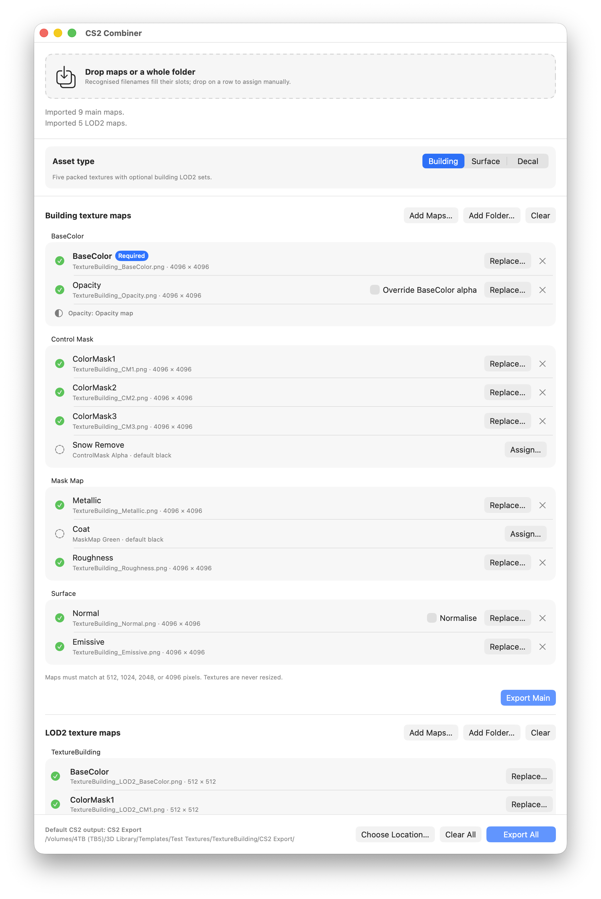
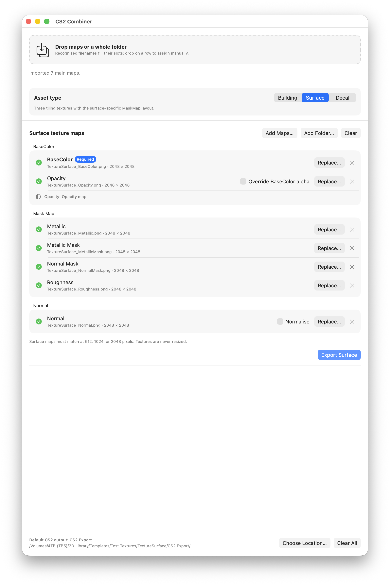
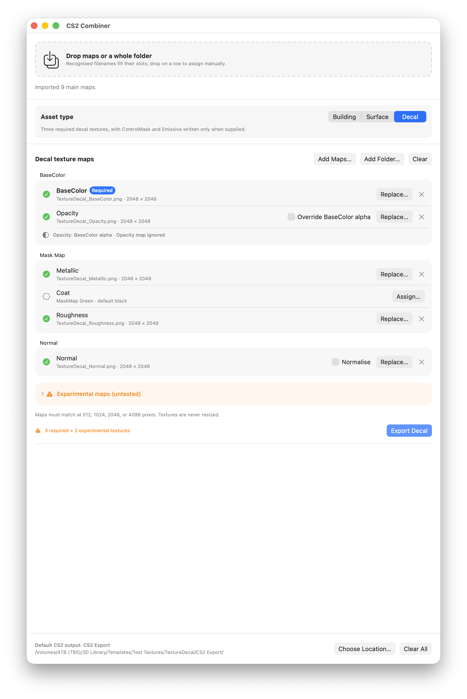
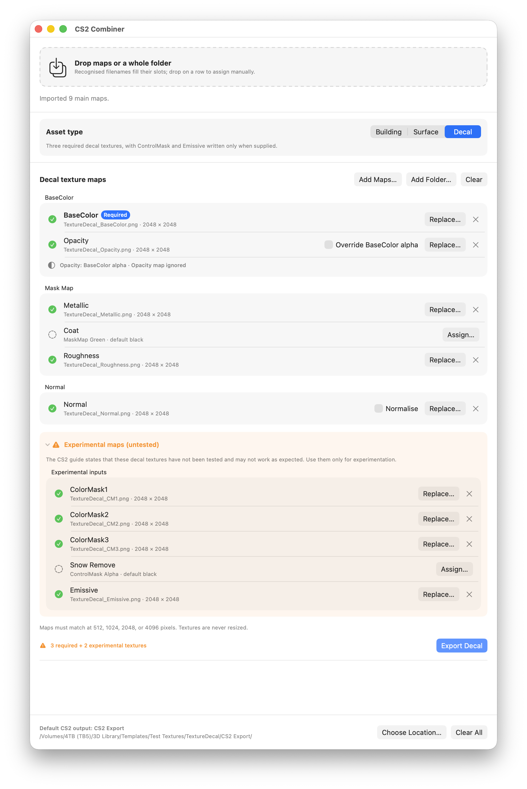
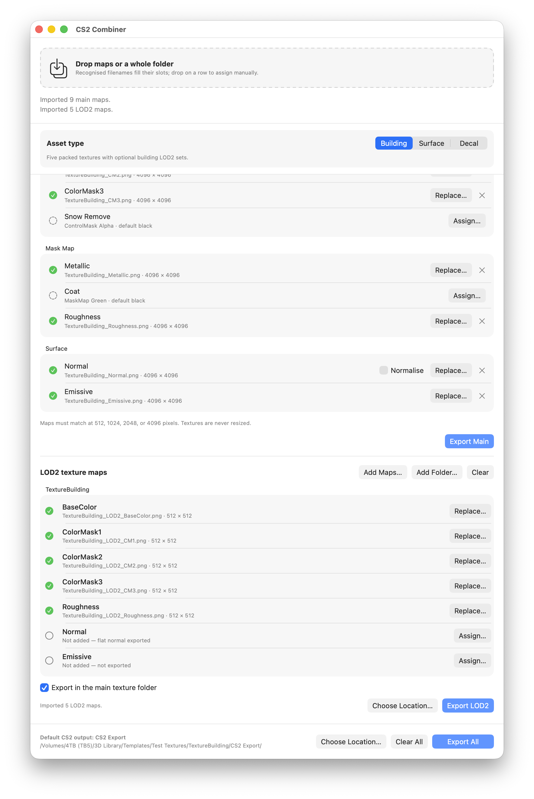

# CS2 Combiner user guide

The polished, screenshot-based edition is available as
[CS2-Combiner-User-Guide.pdf](../output/pdf/CS2-Combiner-User-Guide.pdf).

The screenshots show the macOS app. The Windows app presents the same profiles,
slots, warnings, and export choices with native Windows controls.

## Getting started

Choose **Building**, **Surface**, or **Decal** before importing. Drop exported
maps, drop a whole folder, or choose **Add Maps...** / **Add Folder...**.
Recognised filenames fill matching slots automatically. Drop a file directly on
a row or use **Assign...** / **Replace...** for manual assignment.

Accepted dimensions:

- Building and Decal main textures: square 512, 1024, 2048, or 4096 pixels.
- Surface textures: square 512, 1024, or 2048 pixels.
- Building LOD2 textures: exactly 512 x 512 pixels.
- All assigned maps in a set must match BaseColor. Textures are never resized.

If filenames from another profile are detected, the app warns before switching
or importing them into the current profile.

## Building

Building is the full five-texture workflow and the only profile with LOD2.
BaseColor is required; other inputs use safe packed-channel defaults when absent.

| Group | Inputs | Packed result |
|---|---|---|
| BaseColor | BaseColor, Opacity | BaseColor RGB and active opacity source |
| Control Mask | ColorMask1-3, Snow Remove | RGBA channels in slot order |
| Mask Map | Metallic, Coat, Roughness | Red, green, black, inverse Roughness |
| Surface | Normal, Emissive | OpenGL Normal RGB and Emissive RGB |

The main export writes `<asset>_BaseColor.png`, `_ControlMask.png`,
`_MaskMap.png`, `_Normal.png`, and `_Emissive.png`.

## Surface

Surface is for tiling materials. It writes BaseColor, MaskMap, and Normal and
does not support ControlMask, Emissive, or LOD2.

Surface MaskMap channels are:

| Channel | Source |
|---|---|
| Red | Metallic |
| Green | Metallic Mask, white when absent |
| Blue | Normal Mask, white when absent |
| Alpha | Inverse Roughness |

## Decal

Decal keeps the tested inputs prominent: BaseColor, Opacity, Metallic, Coat,
Roughness, and Normal. BaseColor is required. The standard export writes
BaseColor, MaskMap, and Normal.

**Experimental maps (untested)** contains ColorMask1-3, Snow Remove, and
Emissive. The CS2 guide states these decal textures have not been tested and may
not work as expected. ControlMask and Emissive are written only when this
section is deliberately opened and matching sources are supplied.

## Opacity and normals

The live Opacity row identifies the active export source.

- Embedded BaseColor alpha normally takes precedence.
- An Opacity map is used when BaseColor has no usable alpha.
- **Override BaseColor alpha** makes an assigned Opacity map take precedence.
- With no usable source, BaseColor exports as opaque.

Enable **Normalise** to correct Normal vectors to unit length while writing the
exported Normal texture. The assigned source is never modified. Leave the
checkbox off to preserve the imported OpenGL Normal RGB values. If Normal is
absent, the app creates a flat OpenGL normal output.

## Building LOD2

LOD2 maps are grouped by their shared asset name. Every input must already be
512 x 512 pixels.

The LOD2 set can contain BaseColor, ControlMask, MaskMap, Normal, and Emissive.
Normal is written as a flat OpenGL normal when its source is absent; Emissive is
written when assigned. Keep **Export in the main texture folder** enabled to
place LOD2 beside the main set, or select a separate location.

## Exporting

BaseColor supplies the asset name and native output dimensions. By default, the
app creates `CS2 Export` inside the BaseColor source folder. A custom location
writes directly into the selected folder.

Choose the export button shown for the active profile. Building also offers
**Export LOD2** and **Export All** when appropriate. Resolve size mismatches,
review existing filenames, and approve replacement only when intended. Complete
PNGs are staged before an existing set is replaced.

## Updates

CS2 Combiner checks for a newer stable release when it opens. **Update Now**
downloads the matching package, verifies its published SHA-256 digest and
version, installs it, and reopens the app. **Check for Updates...** is also
available manually.

Windows Smart App Control may block an independently distributed unsigned build
because it cannot verify the publisher. Code signing avoids that warning; it is
not a texture-export error.
