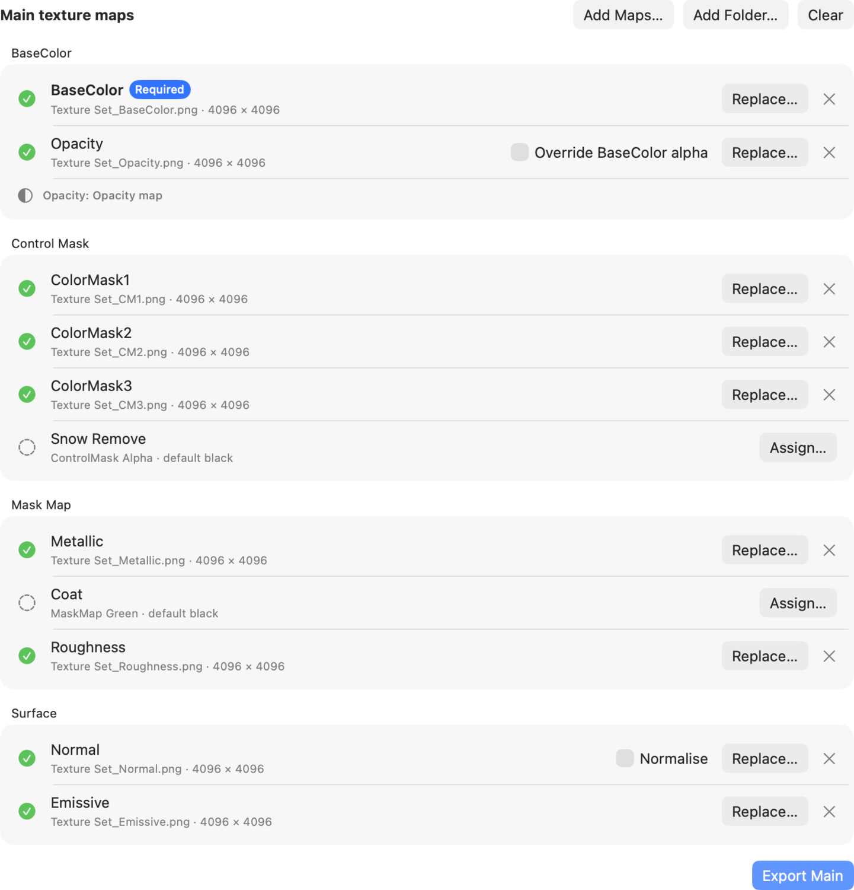
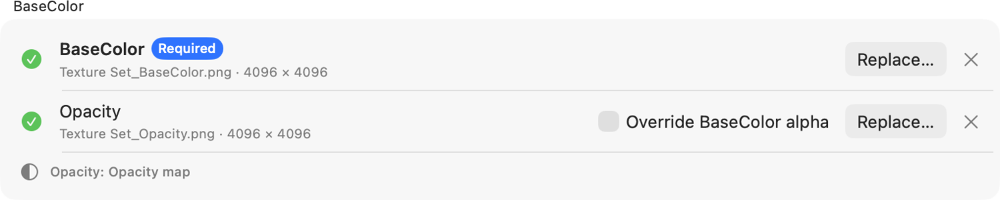
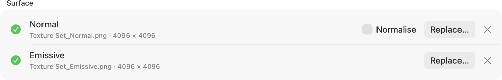
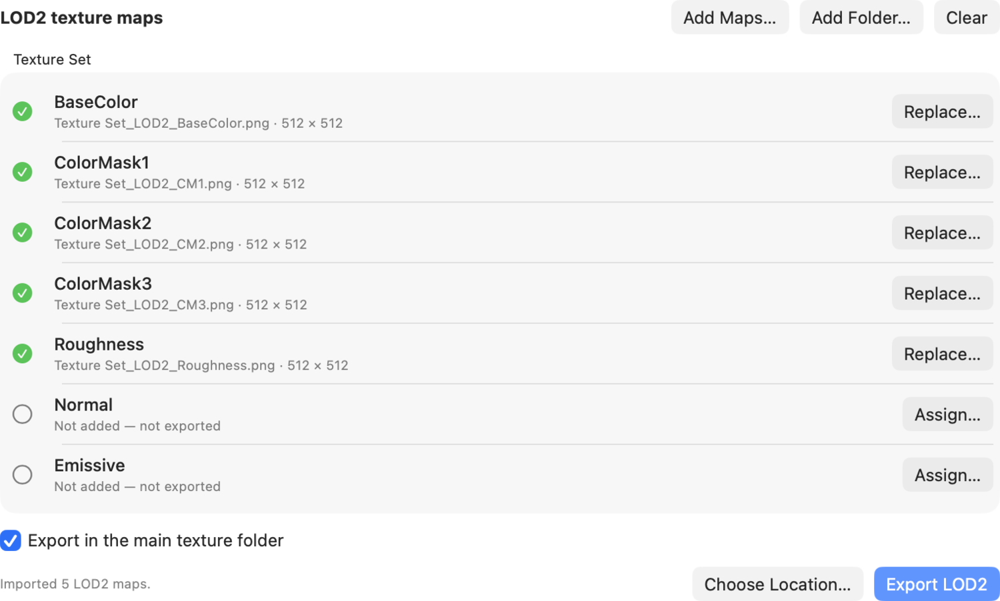

# CS2 Combiner user guide

The polished, screenshot-based edition is available as
[CS2-Combiner-User-Guide.pdf](../output/pdf/CS2-Combiner-User-Guide.pdf).

## Importing

Drop one or more exported texture maps, drop a whole folder, or choose
**Add Maps...** / **Add Folder...**. Recognised filenames fill their matching
slots automatically. Drop a file directly on a row or use **Assign...** /
**Replace...** for manual assignment.

Accepted dimensions:

- Main textures must be square 512, 1024, 2048, or 4096 pixel images.
- LOD2 textures must be exactly 512 x 512.
- Imported textures are never resized.

## Texture Slots

BaseColor is required for a main export. All other slots are optional.

| Group | Inputs | Packed result |
|---|---|---|
| BaseColor | BaseColor, Opacity | BaseColor RGB and active opacity source |
| Control Mask | ColorMask1-3, Snow Remove | RGBA channels in slot order |
| Mask Map | Metallic, Coat, Roughness | Red, green, black, inverse Roughness |
| Surface | Normal, Emissive | OpenGL Normal RGB and Emissive RGB |

Every assigned main map must match the imported BaseColor dimensions. A
mismatch stops export instead of resampling a source.

## Opacity & Normals

The live Opacity row identifies the active export source.

- Embedded BaseColor alpha normally takes precedence.
- An Opacity map is used when BaseColor has no alpha.
- **Override BaseColor alpha** makes an assigned Opacity map take precedence.
- With no usable source, BaseColor exports as opaque.

Enable **Normalise** to correct Normal vectors to unit length while writing the
exported Normal texture. The assigned source is never modified, replaced, or
saved as a separate normalised copy. Leave the checkbox off to preserve the
imported OpenGL Normal RGB values.

## LOD2

LOD2 maps are grouped by their shared asset name. Every accepted input must
already be exactly 512 x 512.

Available outputs are written when their required inputs are assigned, except
Normal, which is always exported as a flat OpenGL normal when no Normal input is
assigned:

- `<asset>_LOD2_BaseColor.png`
- `<asset>_LOD2_ControlMask.png`
- `<asset>_LOD2_MaskMap.png`
- `<asset>_LOD2_Normal.png`
- `<asset>_LOD2_Emissive.png`

Keep **Export in the main texture folder** enabled to place LOD2 output beside
the main set, or choose a separate LOD2 location.

## Exporting

BaseColor supplies the asset name and native output dimensions. By default, the
app creates and writes into `CS2 Export` inside the folder containing
BaseColor. Choosing another location writes directly into that selected folder.

The main export writes:

- `<asset>_BaseColor.png`
- `<asset>_ControlMask.png`
- `<asset>_MaskMap.png`
- `<asset>_Normal.png`
- `<asset>_Emissive.png`

Choose **Export Main**, **Export LOD2**, or **Export All**. Resolve any size
mismatch, review existing filenames, and approve replacement only when
intended. Complete PNGs are staged before replacing an existing set.

**Export All** appears only when both a main BaseColor and at least one LOD2 set
are assigned. With LOD2 maps alone, use **Export LOD2**.

## Common Workflows

- **Import a folder:** drop it once and review the detected main and LOD2 slots.
- **Assign manually:** drop on a row or use **Assign...** / **Replace...**.
- **Use BaseColor alpha:** leave the override off and confirm the live status.
- **Use an Opacity map:** enable the override only when it should take priority.
- **Normalise on export:** enable **Normalise** on the Normal row.
- **Resolve a mismatch:** prepare matching 512, 1024, 2048, or 4096 pixel main maps.
- **Keep outputs together:** use **Export All** with the main folder option.

If an output already exists in the destination, the app lists it and asks
before replacing it.
